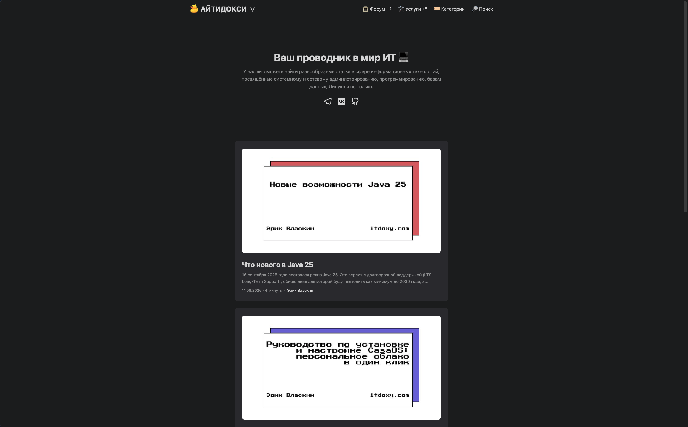

# АЙТИДОКСИ / ITDOXY — ваш проводник в мир ИТ 💻

[](https://itdoxy.com)
[](https://gohugo.io)
[](https://github.com/ITDOXY/itdoxy.com/actions/workflows/main.yml)
[](https://t.me/s/ITDOXY)

**АЙТИДОКСИ / ITDOXY** — технический блог и база знаний по информационным технологиям на базе генератора статических сайтов [Hugo](https://gohugo.io). У нас вы найдёте разнообразные статьи в сфере ИТ: системное и сетевое администрирование, программирование, базы данных, Linux, Docker и не только.

🌐 Сайт: **[ITDOXY.com](https://itdoxy.com)**



---

## 📖 О проекте

**АЙТИДОКСИ / ITDOXY** — это статический сайт на Hugo. Проект ориентирован на читателей, интересующихся современными информационными технологиями. Контент пишется в Markdown, а публикация полностью автоматизирована: после пуша в основную ветку GitHub Actions автоматически собирает сайт и деплоит его.

### Что есть на сайте:

- 🔎 **Поиск** — полнотекстовый поиск по всем статьям
- 🏷 **Категории** — навигация по рубрикам
- 🏛 **Форум** — обсуждение в Telegram
- 👨‍🏫 **Услуги** — занятия, консультации и помощь в области ИТ
- 📰 **RSS-лента** — подписка на новые статьи

---

## 🧩 Тематика сайта

Сайт охватывает широкий спектр информационных технологий:

- 🖥️ **Системное администрирование** — настройка серверов, управление инфраструктурой
- 🌐 **Сетевое администрирование** — сети, протоколы, безопасность
- 💻 **Программирование** — Java, Python, Django и другие языки/фреймворки
- 🗄️ **Базы данных** — SQL, NoSQL, оптимизация запросов
- 🐧 **Linux** — дистрибутивы, утилиты, скрипты
- 🐳 **Docker и DevOps** — контейнеризация, CI/CD, оркестрация
- 🤖 **Искусственный интеллект** — автоматизация, low-code платформы
- 🔍 **SEO и веб-технологии** — оптимизация, аналитика
- и другие темы из мира ИТ

---

## ⚙️ Технологии

- **[Hugo](https://gohugo.io)** — сверхбыстрый генератор статических сайтов
- **[Markdown](https://daringfireball.net/projects/markdown/)** — формат написания статей
- **[GitHub Actions](https://github.com/features/actions)** — автоматическая сборка и деплой

Никаких npm-сборок и лишних зависимостей: только Hugo и Markdown.

---

## ✨ Особенности сайта

### Функциональность:

- ⚡ **Быстрая генерация** — Hugo собирает статические страницы за секунды
- 🏷️ **Теги и категории** — удобная навигация по контенту
- 🔎 **Полнотекстовый поиск** — мгновенный поиск по всем статьям
- 📄 **RSS-лента** — подписка на обновления
- 📱 **Адаптивный дизайн** — корректное отображение на всех устройствах
- 🌓 **Тёмная/светлая тема** — автоматическое переключение (auto)
- ⏱️ **Время чтения** — отображается для каждой статьи

### SEO-оптимизация:

- ✅ `sitemap.xml` — генерируется Hugo автоматически
- ✅ `robots.txt` — включён в конфигурации (`enableRobotsTXT: true`)
- ✅ **Open Graph** — красивые превью при шаринге в соцсетях
- ✅ **Schema.org** — структурированные данные для поисковиков
- ✅ **Мета-теги** — уникальный `title` и `description` для каждой страницы
- ✅ **Человекопонятный URL (friendly URL)** — человекочитаемые адреса страниц (`/:slug/`)
- ✅ **Семантическая разметка** — правильная HTML-структура
- ✅ **Внутренняя перелинковка** — навигация по категориям и тегам

---

## 🚀 Быстрый старт

### Требования

Для локальной работы вам понадобятся:

- [Git](https://git-scm.com/)
- [Hugo](https://gohugo.io/installation/)

### Установка и запуск

```bash
# Клонируйте репозиторий
git clone https://github.com/ITDOXY/itdoxy.com.git
cd itdoxy.com

# Запустите локальный сервер разработки
hugo server -D
```

Сайт будет доступен по адресу: `http://localhost:1313`

### Продакшен-сборка

```bash
hugo --minify
```

Готовые статические файлы появятся в папке `public/`.

---

## 📁 Структура репозитория

```text
.
├── .github/workflows/   # GitHub Actions: автоматическая сборка и деплой
├── archetypes/          # Шаблоны новых статей
├── content/             # Контент сайта (статьи в Markdown)
│   ├── posts/           # Статьи блога
│   └── pages/           # Статические страницы (о сайте, контакты и т.д.)
├── layouts/             # Кастомные шаблоны Hugo (если есть)
├── static/              # Статические файлы: изображения, favicon, robots.txt
├── themes/              # Тема Hugo
├── hugo.yml             # Основной конфигурационный файл
└── README.md            # Описание репозитория
```

---

## ✍️ Как добавить статью

### Создание новой статьи

```bash
hugo new posts/moya-statya.md
```

### Шапка статьи (front matter)

Пример минимальной шапки статьи (front matter):

```yaml
---
title: "Заголовок статьи"
slug: моя-статья
date: 2026-08-16T00:00:00+03:00
cover:
  image: "cover.jpg"
  relative: true
author: Ваше имя
authorUrl: https://ваш-сайт.com
categories:
  - Категория 1
  - Категория 2
draft: false
---
```

**Описание полей:**

| Поле             | Описание                                                   |
|------------------|------------------------------------------------------------|
| `title`          | Заголовок статьи (обязательно)                             |
| `slug`           | URL-адрес статьи, например `моя-статя` (станет частью URL) |
| `date`           | Дата публикации в формате ISO 8601                         |
| `cover.image`    | Обложка статьи (расположена в папке со статьёй)            |
| `cover.relative` | `true`, если обложка в той же папке, что и статья          |
| `author`         | Имя автора                                                 |
| `authorUrl`      | Ссылка на профиль автора (Telegram, сайт и т.д.)           |
| `categories`     | Список категорий (можно несколько)                         |
| `draft`          | `false` для публикации, `true` для черновика               |

### Публикация

1. Создайте ветку для новой статьи:
   ```bash
   git checkout -b feature/new-article
   ```

2. Добавьте статью и сделайте коммит:
   ```bash
   git add content/posts/moya-statya.md
   git commit -m "Добавлена статья: Заголовок статьи"
   git push origin feature/new-article
   ```

3. Создайте Pull Request в основную ветку.

4. После мёрджа GitHub Actions автоматически:
   - соберёт сайт с новой статьёй
   - задеплоит его
   - статья станет доступна на [itdoxy.com](https://itdoxy.com)

---

## 🛰️ Деплой

Деплой полностью автоматизирован:

1. **Пуш в основную ветку** → запуск GitHub Actions
2. **Сборка сайта** → `hugo --minify`
3. **Загрузка файлов** → статические файлы
4. **Обновление сайта** → доступно на [itdoxy.com](https://itdoxy.com)

Весь процесс занимает несколько минут и не требует ручных действий.

---

## 🤝 Как предложить изменения

Нашли ошибку или опечатку в статье? Вы можете предложить изменение прямо на GitHub:

1. Перейдите на страницу статьи на сайте
2. Нажмите кнопку **"Предложить изменение"** (она автоматически генерируется для каждой статьи)
3. Отредактируйте текст в веб-редакторе GitHub
4. Создайте Pull Request

Или откройте [Issue](https://github.com/ITDOXY/itdoxy.com/issues), если нашли техническую проблему.

---

## 📬 Контакты и ссылки

### Официальные ресурсы:

- 🌐 **Сайт:** [https://itdoxy.com](https://itdoxy.com)
- 💬 **Telegram-канал:** [https://t.me/ITDOXY](https://t.me/s/ITDOXY)
- 🏛 **Форум в Telegram:** [https://t.me/ITDOXY_FORUM](https://t.me/ITDOXY_FORUM)
- 💻 **GitHub:** [https://github.com/ITDOXY](https://github.com/ITDOXY)
- 👨‍🏫 **Услуги (занятия и консультации):** [https://services.tochkaplace.com](https://services.tochkaplace.com)

### Технологии:

- Hugo: [https://gohugo.io](https://gohugo.io)

---

## 📝 Лицензия

Контент статей защищён авторским правом.
