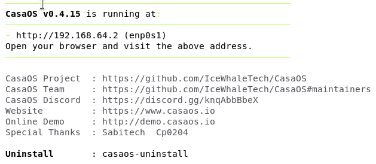
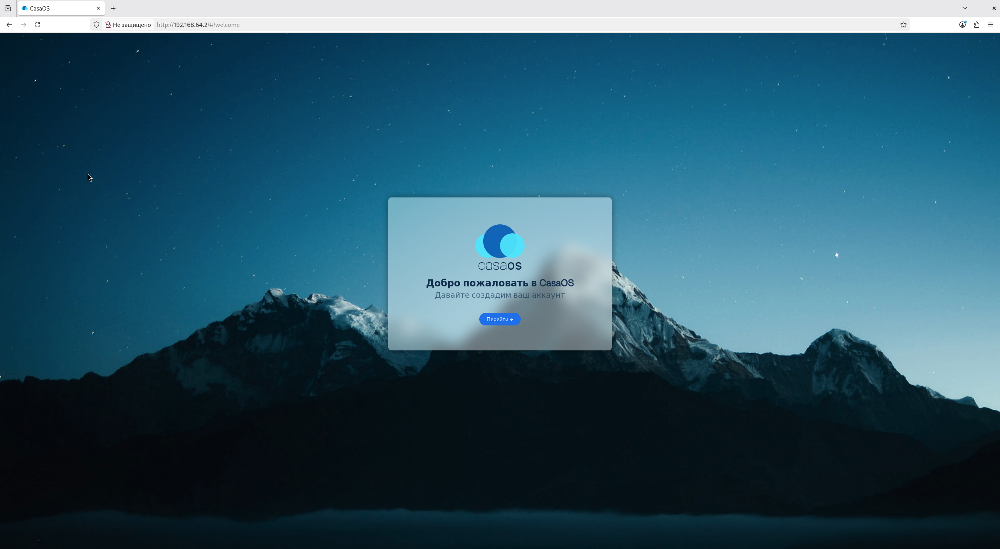
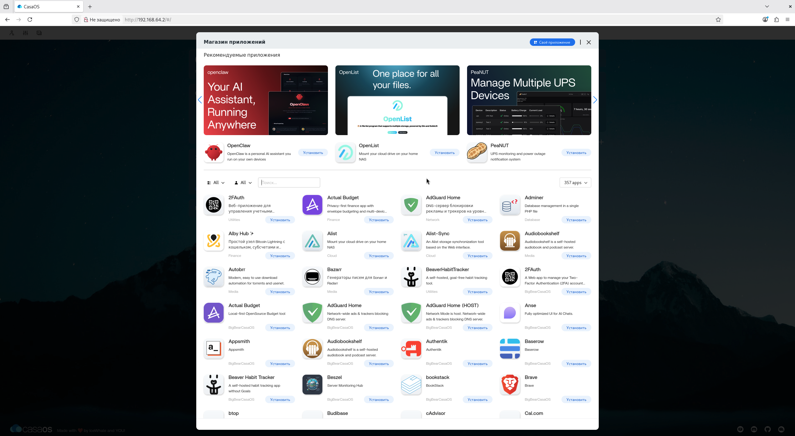
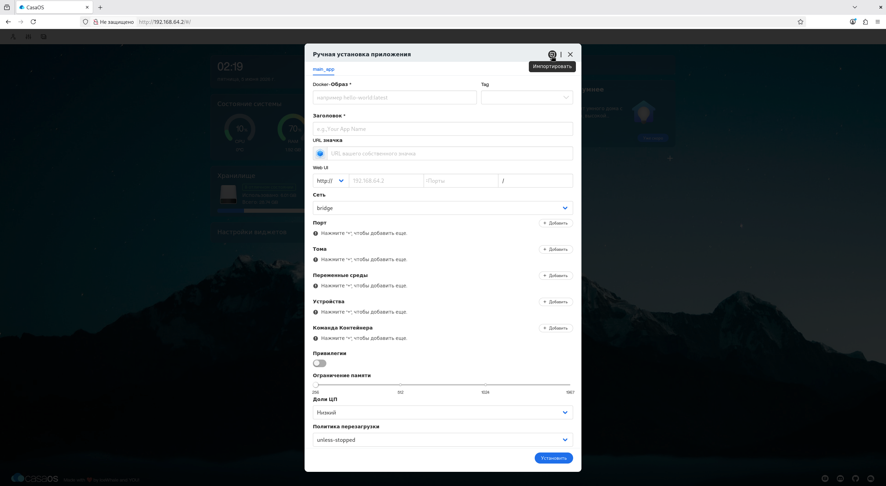
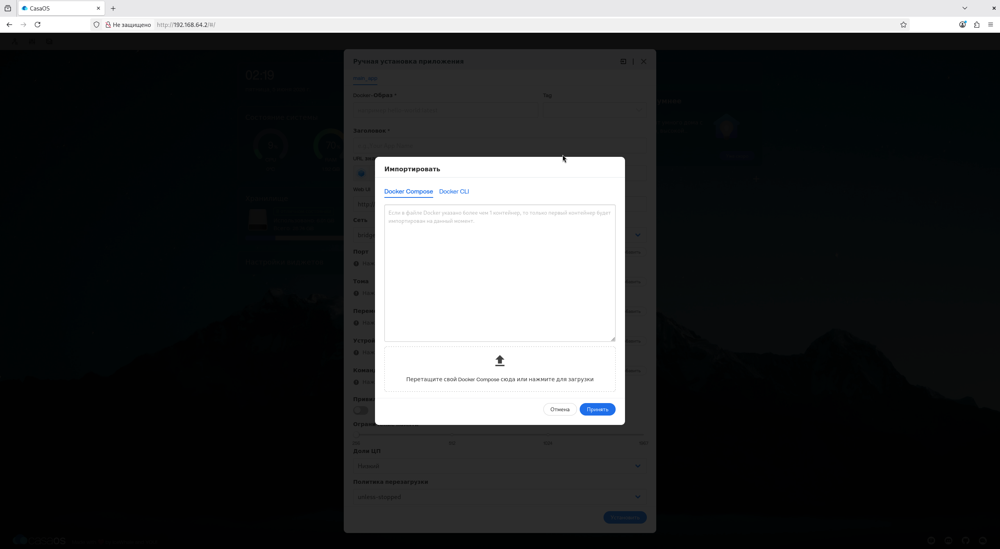
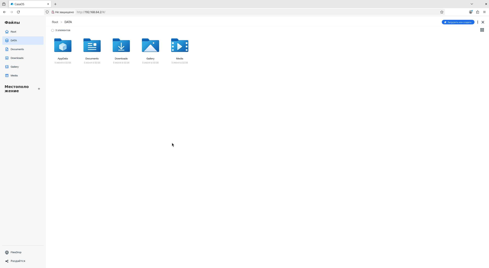
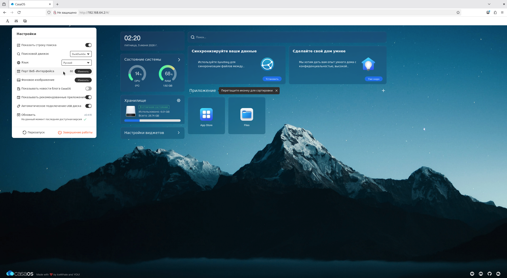
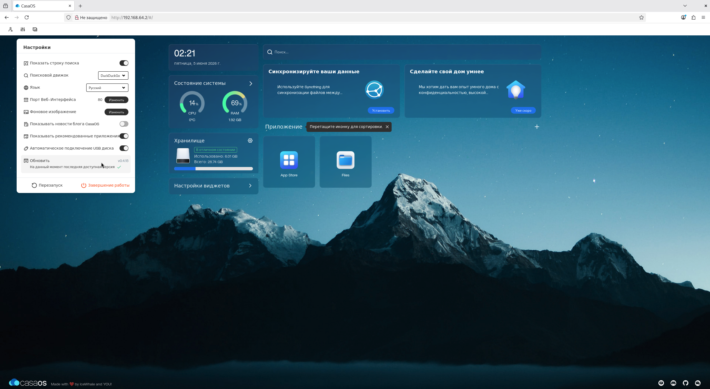

**CasaOS** — это не операционная система в традиционном понимании, а **оркестратор** (hub-система) с открытым исходным кодом, работающий поверх Linux. Она предназначена для упрощения управления домашним сервером и развертывания приложений через экосистему **Docker** (технологию упаковки программ в изолированные контейнеры).

Данное руководство поможет вам развернуть систему, превратив любое устройство — от Raspberry Pi до мощного сервера — в личное облако.

## Подготовка и системные требования

CasaOS позиционируется как модульная система, которая устанавливается поверх существующего дистрибутива.

### Поддерживаемые архитектуры:
*   **x86-64 (amd64):** Обычные ПК, Intel NUC.
*   **ARM64 и armv7:** Raspberry Pi, одноплатные компьютеры.

### Совместимость ОС:
*   **Официальная поддержка:** Debian 12 (рекомендуется), Ubuntu Server 20.04 и Raspberry Pi OS.
*   **Поддержка сообществом:** Arch Linux (через AUR/pacman), Ubuntu 24.04 LTS, CentOS, Armbian, OpenWrt (на стадии тестирования).
*   **Windows:** Возможна установка через **WSL2** (подсистема Linux для Windows) или виртуальные машины (VirtualBox, VMware).

> **Важно:** Для стабильной работы интерфейса рекомендуется минимум 1–2 ГБ оперативной памяти, хотя сам Debian без GUI может работать и на 256 МБ.

## Установка системы

Процесс максимально упрощен и выполняется одной командой в терминале.

### Шаг 1: Обновление системы
Перед началом убедитесь, что ваша операционная система актуальна:
`sudo apt update && sudo apt upgrade -y`.

### Шаг 2: Установка зависимостей
Убедитесь в наличии утилиты **curl** (инструмент для передачи данных по URL):
`sudo apt install curl -y`.

### Шаг 3: Запуск скрипта установки
Выполните команду: `curl -fsSL https://get.casaos.io | sudo bash`.

Процесс занимает от 5 до 10 минут в зависимости от производительности оборудования. По завершении вы увидите IP-адрес для доступа к веб-интерфейсу.

**Специфика для пользователей из РФ:** В некоторых источниках упоминается, что с мая 2024 года доступ к Docker Hub может быть ограничен. Для обхода блокировок предлагается использовать специальные скрипты разблокировки (например, через `docker-unlock`), хотя это стороннее решение.

## Первоначальная настройка

1.  Введите IP-адрес сервера в браузере (по умолчанию порт 80).

2.  Нажмите **Перейти** (Go) на приветственном экране и создайте учетную запись администратора.

3.  Вы попадете в панель управления, где отображаются виджеты ресурсов: использование CPU, RAM, дискового пространства и сетевой трафик.

## Управление приложениями

Основная ценность CasaOS — **Магазин приложений** (App Store).

*   **Установка в один клик:** В магазине доступно более 50 проверенных приложений (Nextcloud, Jellyfin, Plex, AdGuard Home).

*   **Docker-экосистема:** Если нужного приложения нет в магазине, вы можете установить любой из 100 000+ контейнеров с Docker Hub.
*   **Своё приложение (Custom Install):**
    1. Нажмите «Своё приложение» (Custom Install) в магазине приложений (App Store).
    2. Выберите «Импортировать» (Import) и вставьте содержимое файла `docker-compose.yml` или код `docker run`.
    3. Настройте порты и пути монтирования дисков.

## Работа с дисками и файлами

Приложение **Файлы** (Files) позволяет управлять файловой системой напрямую через браузер.

*   **Монтирование дисков:** CasaOS поддерживает автоматическое монтирование USB-накопителей.
*   **Проблема внешних дисков:** В некоторых пользовательских обзорах отмечается, что при использовании внешних HDD для медиасерверов (например, Jellyfin) могут возникать проблемы с правами доступа или автоматическим монтированием после перезагрузки. Рекомендуется настраивать автомонтирование через файл `fstab`.
*   **Перенос данных Docker:** Если основной раздел мал, можно перенести образы и тома Docker на другой диск, обновив параметр `--data-root` в конфиге `docker.service`.

## Расширенные настройки и обслуживание

*   **Изменение порта:** Если порт 80 занят, его можно изменить в настройках веб-интерфейса.

*   **Обновление:** CasaOS можно обновить через UI (Настройки -> Обновить) или командой `curl -fsSL https://get.casaos.io | sudo bash`, которая также служит инструментом обновления.

*   **Проксирование:** Для доступа извне рекомендуется использовать VPN или Reverse Proxy (Nginx, Apache), чтобы не открывать порты напрямую в интернет.

## Известные ограничения

1.  **Статус ZimaOS:** Разработчики (IceWhale) активно развивают **ZimaOS** как «профессиональную» версию CasaOS для своих устройств. Существует опасение, что поддержка классической CasaOS может стать менее приоритетной.
2.  **Безопасность SMB:** В источниках критикуется реализация общих папок (Samba): при простом расшаривании папка может стать доступна любому пользователю в сети без должной авторизации, если не настроить это вручную.
3.  **Ошибки интерфейса:** Некоторые пользователи сообщают о «сырости» системы: потере видимости приложений после перезагрузки или некорректном отображении графиков нагрузки сети и диска на определенных конфигурациях.
4.  **Обновление приложений:** CasaOS не всегда автоматически обновляет Docker-контейнеры до последних версий, если используется тег `latest`. В таких случаях требуется ручное вмешательство через CLI.

**Заключение:** CasaOS — отличный выбор для младших-специалистов за счет простоты и для старших/ведущих как удобная «морда» над Docker для домашнего использования. Однако для критически важных задач стоит учитывать её статус «надстройки» и возможную необходимость ручной правки конфигов Docker через терминал.
